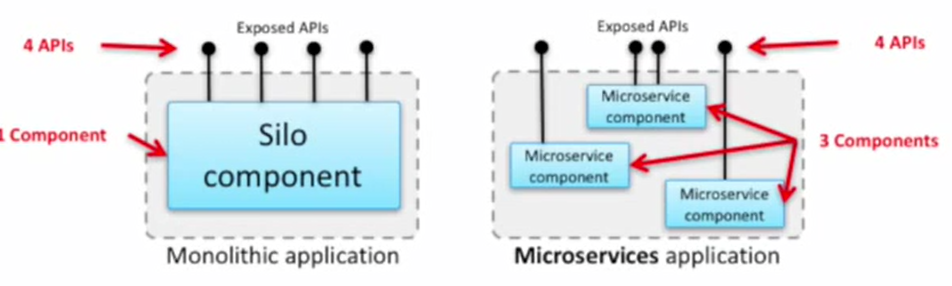
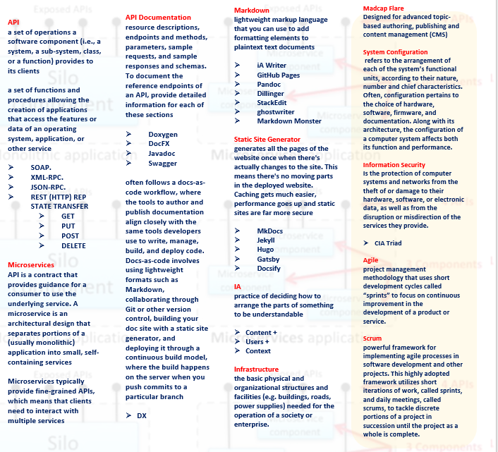
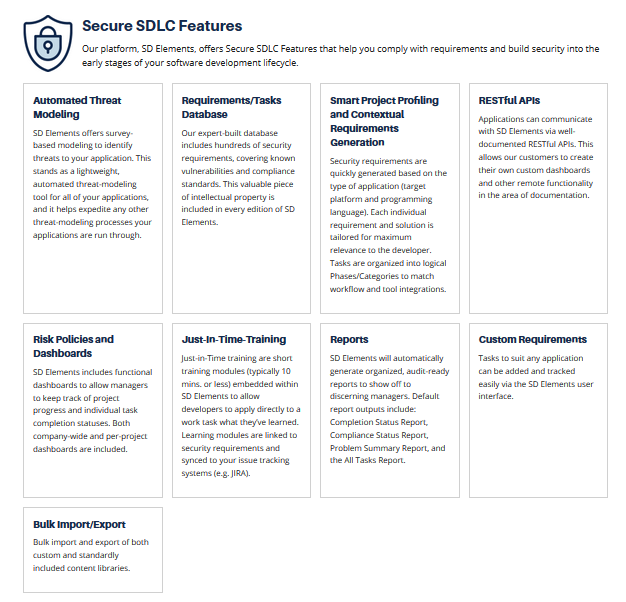
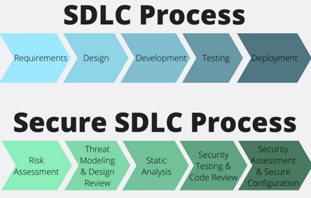
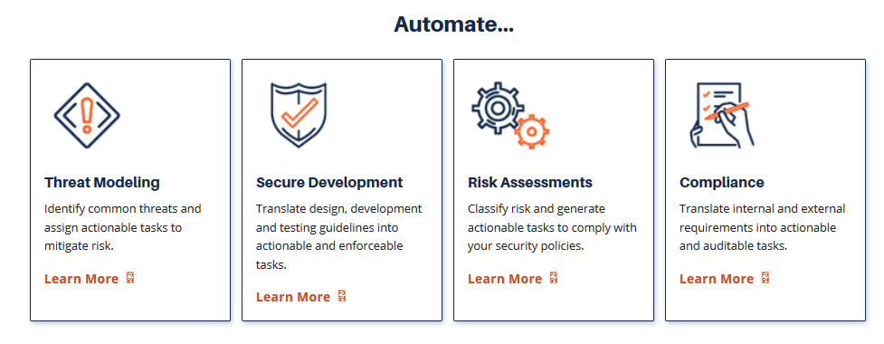
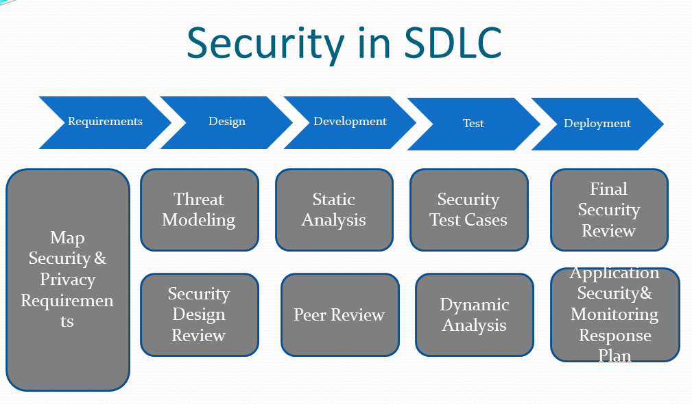

# SC

Looking to have a real and meaningful impact on the global state of information security? Join us as a Technical Writer to help strengthen communication about the source of security issues: insecure software.

You will have a chance to positively impact nearly every part of the world's digital infrastructure by researching and writing about secure software development practices that we communicate to our clients—the world's largest financial services, software, healthcare, telecom, technology, media, and industrial control system companies.

We are looking for a Technical Writer who understands software development lifecycle and cybersecurity concepts. This position is ideal for writers with a passion for communicating about technology, coaching writing skills, and desire to work on a growing organization.

**What you'll do?**

* Assisting with the research, writing, and revision of materials for documentation, and eLearning
* Supporting multiple teams across the company—Research, Product, and Training
* Interviewing SMEs about technical concepts and conveying that information to various audiences
* Coaching team members about writing best practices on an individual and group basis
* Ensuring a consistent style and tone across all technical communication
* Independently researching and learning about software security

**What you'll need to succeed?**

* Must have:
  * Exceptional written and spoken communication skills
  * Ability to quickly learn new domains to the extent needed to do copy editing and deep polishing \(logical flow, rhythm, grammatical consistency, clarity\)
  * Experience teaching and guiding team members on writing best practices
  * Creating writing templates and job aids to reinforce clear communication
  * Developing and updating rubrics to ensure quality of written output
* Nice to have:
  * Understanding of cyber security domain and concepts
  * Basic knowledge of DevOps and software security practices
  * Some experience with one or more programming languages, such as Python, JavaScript, or Java
  * Experience with version control tools, such as GitHub

